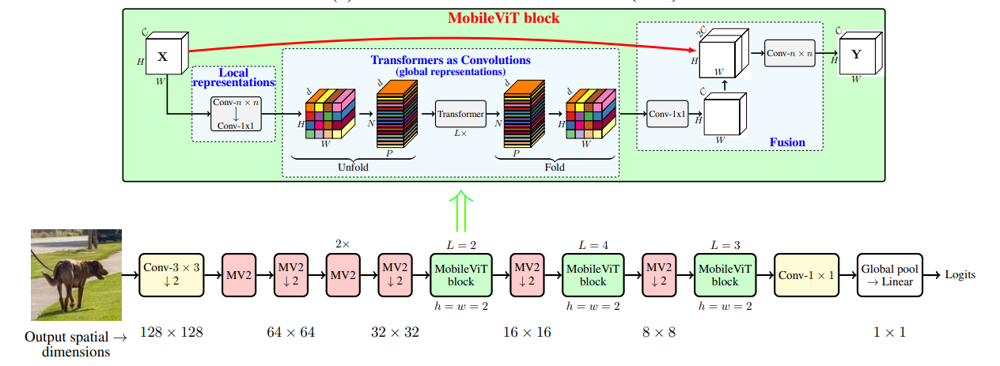
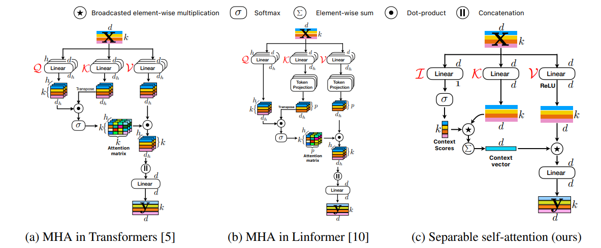

# Mobile-based Vision Transformer - Pytorch

This repository provide minimal Pytorch reimplementation of Vision Transformer Model that could run on edge devices


## Table of Content

- [Check Params and Flops](#how-to-check-models-params--flops)
- [MobileViT](#MobileViT)
- [MobileViTv2](#mobilevitv2)


## How to check model's Params & Flops

I'm using this <a href="https://github.com/facebookresearch/fvcore">library</a> to check the model's params and flops. Feel free to use others :D

```python
import torch
from fvcore.nn import FlopCountAnalysis, flop_count_table 

from mobile_vit.mobilevit import MobileViT

model = MobileViT(
    image_size = (224,224), 
    mode = 'small',             # support ["xx_small", "x_small", "small"] as shown in paper
    num_classes=1000, 
    patch_size=(2, 2)
)
x = torch.randn(5, 3, 224, 224)

flop_analyzer = FlopCountAnalysis(model, x)
print(flop_count_table(flop_analyzer))
```

## MobileViT

</img>

The first paper <a href="https://arxiv.org/abs/2110.02178">MobileViT: Light-weight, Genaral-purpose,and Mobile-friendly Vison Transformer</a> proposed to combine the strength or CNNs and ViTs to build a light-weight and low latency network for mobile vision task.

Sample to import `MobileViT`

```python
import torch
from mobile_vit.mobilevit import MobileViT

model = MobileViT(
    image_size = (224,224), 
    mode = 'small',             # support ["xx_small", "x_small", "small"] as shown in paper
    num_classes=1000, 
    patch_size=(2, 2)
)
x = torch.randn(5, 3, 224, 224)
out = v(x) # (1, 1000)
```

## MobileVitv2

</img>

This paper <a href="https://arxiv.org/abs/2206.02680">Separable Self-attention for Mobile Vision Transformers</a> replaced the *multi-headed self-attention* with a *separable self-attention* with linear complexity and removed skip-connection and fusion in the MobileVit block as they imporve the performance marginally.

Sample to import `MobileViTv2`

```python
import torch
from mobile_vit.mobilevit import MobileViT

model = MobileViT(
    image_size = (224,224), 
    width_multiplier = 2,             # support [0.5, 0.75, 1, 1.25, 1.5, 1.75, 2] as shown in paper
    num_classes=1000, 
    patch_size=(2, 2)
)
x = torch.randn(5, 3, 224, 224)
out = v(x) # (1, 1000)
```

## TODO
- [ ] MobileViTv3
- [ ] MobileViTs Detection
- [ ] MobileViTs Segmentation
- [ ] MobileSAM


## Credits
Some function and code are adapted from official repo <a href="https://github.com/apple/ml-cvnets">ml-cvnets</a>.


## Citations
```bibtex
@inproceedings{mehta2022cvnets, 
     author = {Mehta, Sachin and Abdolhosseini, Farzad and Rastegari, Mohammad}, 
     title = {CVNets: High Performance Library for Computer Vision}, 
     year = {2022}, 
     booktitle = {Proceedings of the 30th ACM International Conference on Multimedia}, 
     series = {MM '22} 
}
@inproceedings{mehta2022mobilevit,
     title={MobileViT: Light-weight, General-purpose, and Mobile-friendly Vision Transformer},
     author={Sachin Mehta and Mohammad Rastegari},
     booktitle={International Conference on Learning Representations},
     year={2022}
}
@misc{mehta2022separable,
      title={Separable Self-attention for Mobile Vision Transformers}, 
      author={Sachin Mehta and Mohammad Rastegari},
      year={2022},
      eprint={2206.02680},
      archivePrefix={arXiv},
      primaryClass={cs.CV}
}
```